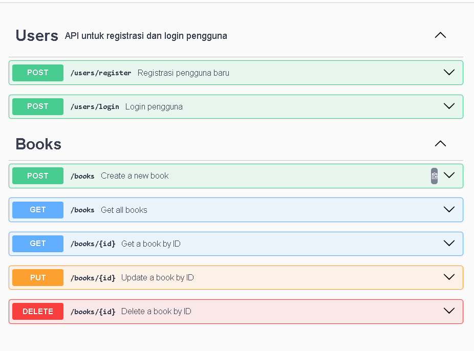

# Task-4

## deskripsi tugas
Buatlah API sederhana untuk aplikasi manajemen buku
menggunakan Express.js dan MongoDB. API ini harus
memungkinkan pengguna untuk melakukan CRUD (Create,
Read, Update, Delete) pada data buku serta mencakup fitur
keamanan, pengaturan header, dan dokumentasi yang baik
menggunakan Swagger.

## dokumentasi swagger

